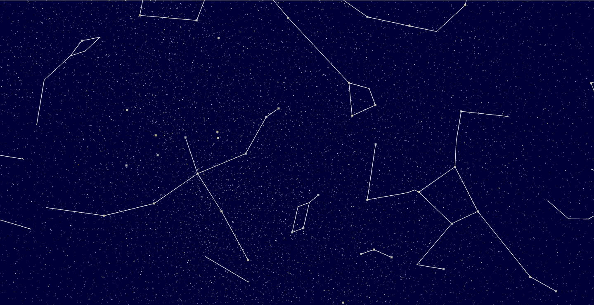

# milkyway
[Three.jsで作る天の川銀河 – ParticleSystem](http://washitake.com/blog/archives/224) を参考に、星の等級でパーティクルを分けたり、星座線を引いたりしたもの。  
星座線データ は[Astro Commonsさんの星座線CSV](http://astronomy.webcrow.jp/hip/hip_constellation_line.csv) を拝借しました。  
また、3D酔いしないように[PointerLockControls](https://github.com/mrdoob/three.js/blob/master/examples/js/controls/PointerLockControls.js)を使用するように変更しました。

# Screenshot

